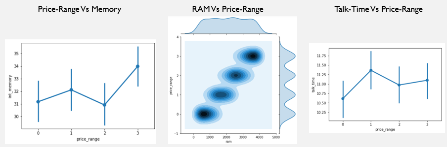
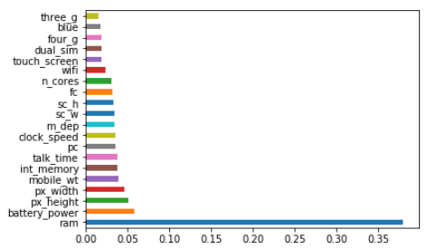
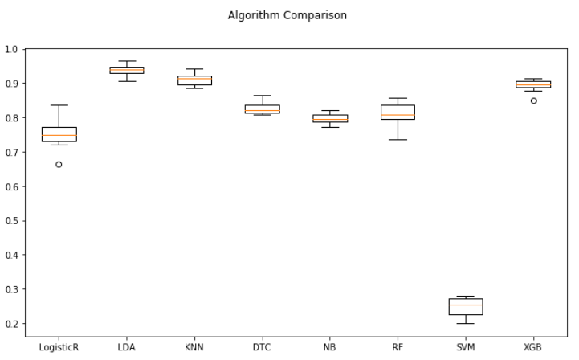
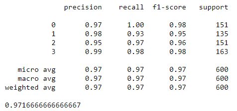
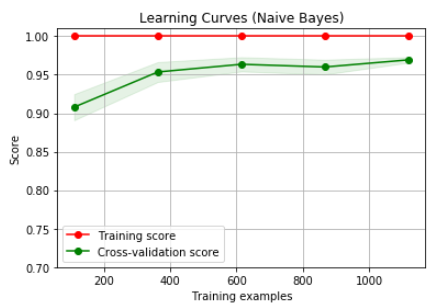

# Mobile-Price-Prediction
Mobile Price analysis and Visualization with Machine learning algorithms

## Project Flow
1) **Import Libraries**
2) **Dataset Processing**
3) **Data Visualization**
    * 
      
   * **Feature Importance**
    * 
   
4) **Model Building With ML-Algos**
   * Logistic Regression
   * LDA
   * K-Nearest Neighbors
   * Decision Tree Classifier
   * Naive Bayes
   * Random Forest
   * Support Vector Machines
   * XG-Boost
      
   * **Performance measure**
    * 
   
5) **Hyper Parameter Tuning**
   * all Machine Learning algorithm are tuned with with their parameters for more accuracy.    
   * Classification report after applying **Tuning** the parameters
    * 
   
6) **Learning Curves**
    * 
